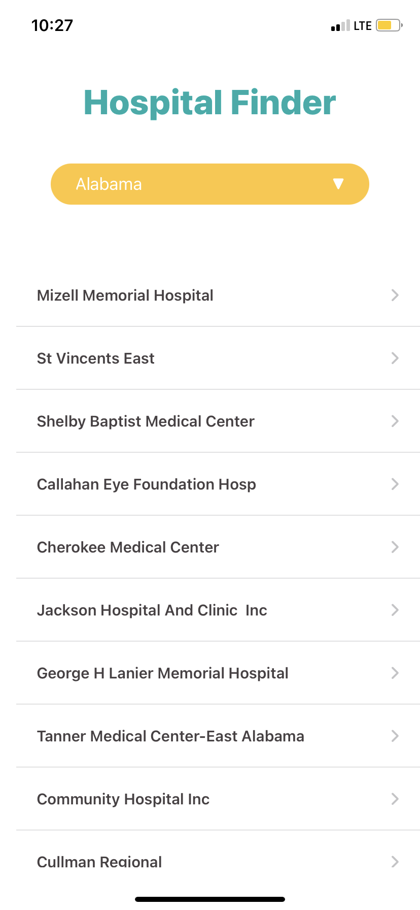

# Hospital iOS Application

### Table of Contents
* [Intro](#Intro)
* [Technologies](#technologies)
* [Screenshots](#screenshots)

### Intro
Hospital App is used to display Hospitals and Hospital details in a state.
    
### Technologies
  <li> Swift Version 12.5.1
  <li> SwuiftUI
   
### Screenshots

    

  
   
  

 </ol>
 
   
 
   
 ---

